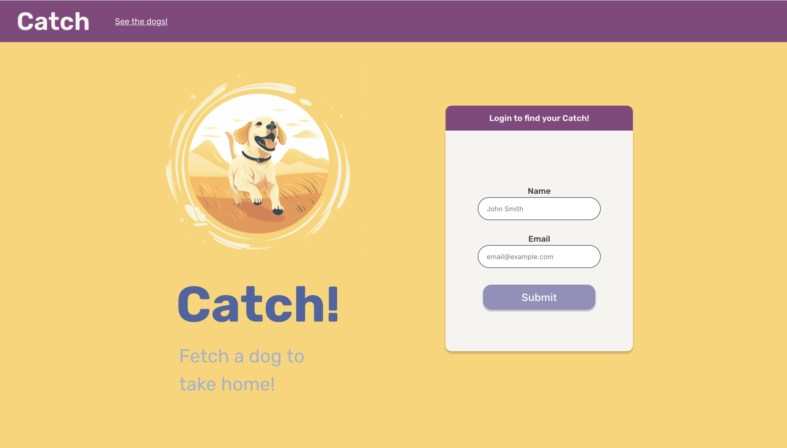

# Fetch Take Home Project
[Try it out!](fetch.tokyrios.com)

___
## About the project
For this project, I built Catch! Catch is a website to pair prospective dog owners with
shelter animals looking for a home. The way the site works is once a user logs in, they
will be presented with a page with the dogs that are available to be adopted. The user
can filter the results and choose which breeds of dogs they would like to see. The user
can also change what order the results are displayed in. By default the dogs are
displayed in ascending alphabetical order by breed. The user can change the sorting
behavior to also sort by the dogs' name or age. Any of these three sorting options can
be set to display in descending order as well.  
The user can add dogs to their list of favorites that they can see on the "Favorites" page.
On the "Favorites" page, the user can remove any dogs that they may have decided they would
not want to adopt and then proceed to find a match. When the user finds a match, the site
takes all of their favorited dogs and then displays to them the one they match with for
adoption.